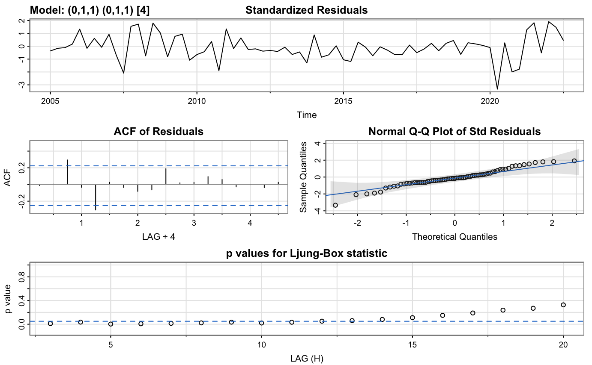

```{r setup, include=FALSE}
knitr::opts_chunk$set(
	eval = TRUE,
	echo = TRUE,
	message = FALSE,
	warning = FALSE
)
library(tidyverse)
library(janitor)
library(reshape)
library(astsa)
library(TSA)
library(forecast)
```

# Introduction
The goal of this analysis is to create a seasonal ARIMA model of the American Public Transportation Association (APTA) Ridership data set. 

# Importing the Data
First, I will import the data and make any necessary modifications before turning them into time series.

```{r}
apta <- read.csv('data/apta_ridership_1990_2023.csv')
octa <- read.csv('data/octa_ridership_2002_2023.csv')

apta <- clean_names(apta)
octa <- clean_names(octa) %>% subset(select = -c(ntd_id, legacy_ntd_id, status,reporter_type,uza,uza_name,mode,tos))

apta_total <- apta$total_ridership_000s
octa %>% head()
```
In order to make the OCTA into a time series, we'll need to melt the year columns and then grab the values.

```{r}
octa2 <- octa %>% melt(id=c('agency'))
octa2 %>% head()
octa_vals <- octa2$value
```
The last thing we need to do is convert the numbers into numeric values, since they are currently characters.

```{r}
apta_total_num <- as.numeric(gsub(',', '', apta_total))
octa_vals_num <- as.numeric(gsub(',','', octa_vals))
```

Now we can make them into time series. The APTA data is quarterly and begins in Q1 of 1990 and ends in Q4 of 2022, so we'll need to specify that. The OCTA data is monthly, beginning in January 2002 and ending on January 2023.

```{r}
apta_ts <- ts(apta_total_num, start = c(1990, 1), 
                          end = c(2022, 4), 
                          frequency = 4)

octa_ts <- ts(octa_vals_num, start = c(2002, 1), 
                         end = c(2023, 1),
                         frequency = 12)
```

Now that we have our time series object, we can begin our analysis.

# SARIMA Modeling
For the first part of our analysis, we will be fitting a **SARIMA** (Seasonal Auto-Regressive Integrated Moving Average) model to both of our time series. In order to do so, we will first make the necessary transformations to the original time series before looking at ACF and PACF plots. We will then come up with the appropriate model and make any adjustments to the parameters that will improve model performance.

## Plotting the Time Series
First we'll take a look at the log-scaled plots.

```{r}
apta_l <- log(apta_ts)
octa_l <- log(octa_ts)
p1 <- plot.ts(apta_l)
p2 <- plot.ts(octa_l)
```

We can see that both plots feature a big dip at 2020 which is unsurprising, but will definitely affect our analysis. We can also see that there is somewhat of an upward trend for the APTA data before the dip and an upward trend after. The OCTA data appears to have a more clear downward trend. We will take the first difference of the data and investigate the plot.

```{r}
apta_dl <- diff(apta_l)
octa_dl <- diff(octa_l)
plot.ts(apta_dl)
plot.ts(octa_dl)
```

The first difference has de-trended the plots, so now we can look at the auto-correlation function (ACF) plots for each graph.

```{r}
acf2(apta_dl)
acf2(octa_dl)
```

The ACF plot for APTA looks pretty typical; after lag 0, the points are all within the confidence interval, however the values at lag 1 are larger than the other lags. The PACF is also contained within the confidence interval, but shows more of a geometric decay pattern.

The ACF plot for OCTA has very clear spikes at lag differences of 1 which implies 12 month seasonality. The PACF corroborates this with a spike at lag 1. To address this, we will need to take a 12th difference for this data.

I will also take a 4th difference for the APTA to determine which model should be used for SARIMA.

## ACF and PACF Plots
To determine what SARIMA model we should use for these time series, we will look at the ACF and PACF plots after differencing out the seasonal component.

```{r}
apta_ddl <- diff(apta_dl, 4)
octa_ddl <- diff(octa_dl, 12)
acf2(apta_ddl)
acf2(octa_ddl)
```

**APTA ACF/PACF Interpretation:**
For the seasonal component, we want to look at the behavior of the graphs *at the lags*. Here, we can see that the ACF has a large negative spike at 1, while the PACF features geometric decay. This is indicative of a *seasonal* first-order moving average model.

For the non-seasonal component, we want to look at the behavior of the graphs *within the lags*. The ACF has a peak and then stays near zero while the PACF decays, so this could be a moving average model.

**OCTA ACF/PACF Interpretation:**
The ACF and the PACF for the OCTA data exhibit similar behavior to the APTA data. At the lags, there is a spike at 1 for the ACF and geometric decay for the PACF. This means that a seasonal first-order moving average model would likely work here, too.

Between the lags, both the ACF and PACF appear to tail off, suggesting an ARMA(1,1) model.

## Fitting the SARIMA Model
Now that we have an idea of what models should be used for these series, we can begin fitting them.

First, we'll try fitting the APTA time series to our SARIMA model.
```{r, message=FALSE}
apta_sarima <- sarima(apta_l, 0,1,1, 0,1,1, 4, details=FALSE)
apta_sarima$ttable
```


The coefficients are significant for both ma1 and sma1, and the diagnostic plots show that the ACF of the residuals are within the confidence interval, so we can go ahead with this model in our predictions.

Now, we will fit OCTA.

```{r}
octa_sarima <- sarima(octa_l, 1,1,1, 0,1,1, 12, details=FALSE)
octa_sarima$ttable
```


The ar1, ma1, and sma1 parameters are all significant! The diagnostic plot shows that the residuals are within the confidence interval, so we can use this model to make predictions for the OCTA time series.

## Forecasting
Now that we have our models, we can make forecasts.

```{r}
sarima.for(apta_l, 12, 0,1,1, 0,1,1, 4)
```

The SARIMA forecast for the APTA time series predicts that total ridership will remain relatively constant for the next 3 year with a bit of quarterly fluctuation.


```{r}
sarima.for(octa_l, 36, 1,1,1, 0,1,1, 12)
```

The SARIMA forecast for the OCTA time series predicts that bus ridership for the OCTA will decrease over the next 3 years while also following monthly fluctuations.

# ARIMAX Modeling
For the second part of our analysis, we will be taking the OCTA time series and adding a second variable, California GDP. To do this, we will fit an ARIMAX model (an ARIMA model but with an e**X**ogenous variable). 

## Adjusting Data
First, I'll have to import the GDP data and make sure that the periods and time span match each other.

```{r}
# Creating California GDP time series object
ca_gdp <- read.csv('data/SQGDP2_CA_2005_2022.csv')
ca_gdp2 <- clean_names(ca_gdp) %>% subset(select = -c(geo_fips,geo_name,table_name,line_code,industry_classification,description,unit))

ca_gdp3 <- ca_gdp2[1,] %>% melt(id = c('region'))

ca_gdp_ts <- ts(ca_gdp3$value, 
                start = c(2005, 1), 
                end = c(2022,3), 
                frequency = 4)
```

We will need to alter the OCTA time series to match the GDP time series. This means making it quarterly instead of monthly, beginning in 2005 Q1, and ending in 2022 Q3. 

```{r}
octa_quarterly_ts <- aggregate.ts(octa_ts, nfrequency = 4)
octa_q_ts <- window(octa_quarterly_ts,
                    start = c(2005, 1),
                    end = c(2022, 3))
```

Before beginning our model fitting, let's look at how the time series compare. 

```{r}
ca_gdp_l <- log(ca_gdp_ts)
octa_q_l <- log(octa_q_ts)

ca_gdp_ld <- diff(ca_gdp_l)
octa_q_ld <- diff(octa_q_l)

plot(octa_q_ld, type='l', col='darkorange')
lines(ca_gdp_ld, col='darkolivegreen4')
legend('topright', 
       legend=c('OCTA','CA GDP'), 
       lty= 1,
       col=c('darkorange', 'darkolivegreen4'))
```

While OCTA ridership is generally more volatile than CA GDP, we can see that there is some relationship between the two graphs. The clearest example of this is in 2020 where both have a downward spike, but in other parts, the smaller spikes line up. 

## Model Fitting
Now that we have our data matched up, we can now investigate whether CA GDP really does help explain some of the variation in OCTA. Since we found a good SARIMA model for the univariate OCTA time series, we will start by using those parameters and then adding CA GDP as an exogenous variable.

```{r}
model <- sarima(octa_q_l, 1,1,1, 0,1,1, 4, xreg=ca_gdp_l, details=FALSE)
model$ttable
```



The table tells us that all of the parameters are significant. The `xreg` parameter in particular is quite significant which tells us that adding CA GDP as an exogenous variable helps in explaining variation in OCTA. This is an interesting result, since it points out a clear relationship between CA GDP and bus ridership in Orange County, California. 

The diagnostic plots shed some more light on how this fit has performed. The standardized residuals have a smaller range compared to the original OCTA SARIMA model: the SARIMA residuals ranged from around -8 to 4 while the SARIMAX model ranges from around -3 to 2. This tells us that this model's predictions fit the actual values more closely than the original. However, looking at the Ljung-Box statistic, we see that there are a number of values falling below the 0.05 range, which tells us that there could be variation that can be captured by changing the seasonality or adding more terms. We will try to capture this by increasing the period.

```{r}
model <- sarima(octa_q_l, 1,1,1, 0,1,1, 8, xreg=ca_gdp_l)
model$ttable
```


# Threshold Modeling


